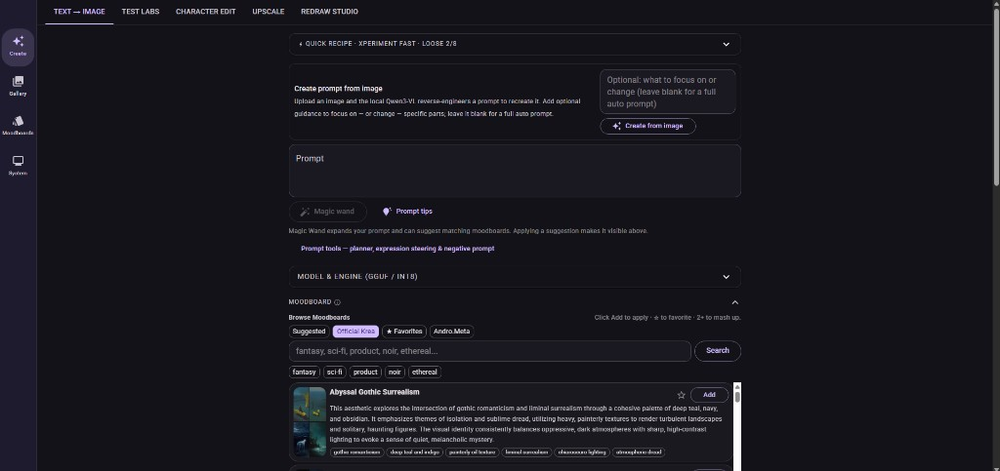

# Krea 2 Local Studio

Local, web-based Krea 2 Studio for Windows, built on **ComfyUI as the generation engine**. The FastAPI backend composes ComfyUI graphs for every image operation; the React frontend provides a friendly, login-gated studio UI for text-to-image, redraw, img2img, inpaint/outpaint, character edit, depth control, upscaling, moodboards, LoRAs, gallery review, and optional Tailscale sharing.



This is an unofficial local studio. It is not affiliated with Krea AI.

## Architecture

**ComfyUI is the backend.** One `run.bat` brings up a hidden ComfyUI engine (port 8188) and the Studio server together. Every diffusion feature — generation in all modes, ControlNet, upscalers, seed variance, the Qwen3-VL helper LLM — executes as a ComfyUI graph built by `backend/comfy_workflows.py`. This keeps the project on the fastest, best-supported runtime with the largest node/developer ecosystem, so new community workflows can be adopted quickly.

The Studio layer adds what raw ComfyUI does not have: a task-oriented UI, a generation queue, moodboards, per-user galleries and auth, child safety moderation, metadata-reproducible outputs, and public sharing.

The legacy in-process PyTorch pipeline has been removed. Non-diffusion helpers that remain in-process are intentionally lightweight: CLIPSeg automask, CivitAI browsing, gallery/auth/moderation, and a RealESRGAN fallback used only if ComfyUI is unreachable.

## Current Capabilities

- **Text to image:** Krea 2 Turbo (INT8 ConvRot default, fp8/bf16/GGUF selectable), Krea 2 RAW with auto-4K SeedVR2 post-pass.
- **Animate (experimental):** short 2D, depth-aware 3D, video-input, or static-camera animations with prompt and motion timelines, resumable chunk rendering, and private video gallery output.
- **Image workflows:** redraw (incl. NK2E preset), img2img, inpaint (incl. LanPaint), outpaint with seam harmonize, character edit (Krea2Edit identity nodes), depth ControlNet, style transfer, in-context vision edit, turbo 4X template.
- **Quality modes:** God Mode, Mr. Flow SR pipeline, RBG smart seed variance, CFG-Zero*, regional prompts, expression steering.
- **Helper AI:** Magic Wand prompt expansion, prompt planner, and image describe via Comfy QwenVL (abliterated Qwen3-VL), with Transformers/GGUF-server/OpenRouter alternatives.
- **Moodboards:** the full public Krea catalog (3,549 boards) with subject-safe v2 style guidance and unique titles, the Andro.Meta curated set, custom boards, Qwen-synthesized mashups, favorites, and a portable seed. Also published as a standalone ComfyUI node pack: [ComfyUI-Krea-Moodboards](https://github.com/Andro-Meta/ComfyUI-Krea-Moodboards).
- **Upscaling:** SeedVR2 (3B/7B), Ultimate tiled refine, 2-pass refine, tiled VAE, ESRGAN/Remacri — all as Comfy graphs.
- **Batch:** safe queued batch by default, true parallel batch when it fits, INT8 variant sweep.
- **Sharing:** login-gated Tailscale Funnel at `/krea` with self-healing startup, admin/user/child roles, private per-user galleries.
- **Child safety:** prompt moderation before generation, local NSFW image classification after, admin-visible audit events.

## What This Repo Contains

- FastAPI backend that orchestrates ComfyUI graphs plus queues, gallery, sharing, moderation, and admin APIs.
- React/MUI frontend for Create (including the experimental Animate tab), Redraw Studio, Character Edit, Test Labs, Gallery, Moodboards, and System controls.
- Windows install/run scripts that manage the bundled ComfyUI engine.
- Portable Krea moodboard seed data in `data/krea_moodboards_seed.json`.

This repo does **not** include generated images, user credentials, local passwords, local logs, `.env`, model caches, the ComfyUI checkout, or dependency directories.

## Setup

Install Python 3.12+ and Node.js 18+, then run:

```bat
install.bat
```

`install.bat` creates the Python venv, installs dependencies, asks for your optional **Hugging Face** and **CivitAI** API tokens (they speed up every download and unlock gated/CivitAI models; both skippable), sets up the ComfyUI engine with all required custom nodes (Krea2 nodes, QwenVL, RES4LYF, LanPaint, Ultimate SD Upscale, SeedVR2, RBG seed variance, Krea2Edit, KJNodes, and more), downloads the default assets (Turbo INT8 ConvRot checkpoint, abliterated Qwen3-VL text encoder, Qwen VAE, Character Edit identity LoRA, NK2E LoRA, depth ControlNet pack, FaceDetailer detector), offers the optional **God Mode** refine pack (~19 GB, skippable, installable later), and builds the frontend. For Animate it also provisions the revision-pinned KreaDeforum node and hash-pinned dependencies, applies the checked `krea2-chunking-v1` compatibility patch, and explicitly prewarms MiDaS Small for 3D mode. Animate and MiDaS readiness are shown under **System > KreaDeforum / Animate**. Tailscale (for public sharing) is likewise offered but optional.

Then start the login-gated sharing app (ComfyUI comes up automatically, hidden):

```bat
run.bat
```

For local-only LAN mode without share auth:

```bat
run.bat local
```

Closing the terminal (X button or Ctrl+C) shuts down both the Studio server and the ComfyUI engine; a detached janitor guarantees VRAM/RAM is freed.

## Models and Assets

The default install prepares, under the ComfyUI model folders:

- Krea 2 Turbo INT8 ConvRot checkpoint, abliterated Qwen3-VL fp8 text encoder, and Qwen-Image VAE under `models/krea2/` (mapped into ComfyUI via `extra_model_paths.yaml`)
- Character Edit identity LoRA, NK2E LoRA, filter-bypass LoRA, and depth Control LoRA under `models/loras/`
- Depth-Anything-3 (small) under `models/geometry_estimation/`
- SR models (RealESRGAN x2, Remacri x4) under `models/upscale_models/`
- FaceDetailer bbox detector under `ComfyUI/models/ultralytics/bbox/`
- helper Qwen3-VL for the QwenVL nodes (auto-fetched on first helper use)

Krea 2 RAW, the SeedVR2 DiTs (auto-download on first upscale), and the God Mode pack (Z-Image Turbo refine, ~19 GB — `scripts/download_godmode_assets.py` or System > Quality Assets) are optional. Engine/quantization variants (INT8, fp8, bf16, GGUF) are selectable per generation; they choose the matching ComfyUI UNET loader.

## Animate (Experimental)

Open **Create > Animate**, between **Text → Image** and **Test Labs**. This feature wraps an external, chunked KreaDeforum workflow and incurs real diffusion time, VRAM use, and disk use on the host GPU.

### Runtime and controls

- **Basic** sets the prompt timeline, optional negative prompt and starting frame, duration/playback FPS, quality preset, size, and seed. Defaults are **4 seconds**, **12 FPS**, **768×768**, and **8 steps**.
- **Motion** selects **2D**, **3D**, **Video Input**, or **None**, offers motion presets and start/end controls, and exposes border, seed, color, cadence, and hybrid options. Defaults are **2D**, seed behavior **iter**, diffusion cadence **1**, and **Match Frame 0 LAB** color coherence.
- **Timeline** edits validated raw `frame:(expression)` motion, denoise, and CFG schedules while preserving prompt keyframes.
- **Advanced** exposes the rendered-frame override, steps, sampler/scheduler, seed and border behavior, cadence, and runtime diagnostics. The defaults are sampler **er_sde** and scheduler **simple**; admission falls back to **euler** if `er_sde` is absent from the active ComfyUI sampler catalog.

`2D` pans/zooms/rotates a flat frame; `3D` adds MiDaS depth-aware translation and rotation; `Video Input` uses an uploaded source video for hybrid motion; `None` keeps the camera static while diffusion evolves the image. Starting images and videos are selected through the browser. Video Input accepts only a server-controlled upload and passes an opaque upload ID—client filesystem paths are never accepted.

### Limits, queueing, and safety

- One animation may be active per user. Work is split into sequential **8-frame** chunks; each chunk re-enters the shared fair GPU queue so users can take turns instead of one long animation monopolizing it.
- Durable state and committed frames recover after restart. Cancel marks the parent terminal, atomically interrupts only its active ComfyUI prompt when needed, discards staging, and prevents another chunk from continuing.
- Job status, WebSocket progress, uploads, MP4/poster delivery, and gallery actions are owner-scoped (admins retain administrative access); other users do not receive private job details.
- The hard limits are **720 rendered frames** and **1536 pixels per dimension** (dimensions must also be divisible by 16). FPS is capped at 60. **60 FPS controls playback/interpolation, not 60 diffusion renders per second**; diffusion cadence determines how many frames invoke diffusion.
- Child accounts receive prompt and input checks before admission. After rendering, only the first and last frame of each child-owned chunk are sampled for image moderation; a failed or unsafe sample blocks and quarantines the chunk.

### Uploads, outputs, and disk use

Video Input accepts MP4, MOV, WebM, or MKV uploads. Defaults are 256 MiB per file, at most 3 uploads/512 MiB per user, 32 uploads/2 GiB globally, 60 seconds, 720 source frames, and 1536 pixels per dimension. Unused uploads expire after 24 hours; the selected upload is deleted when its run reaches a terminal state. A source upload transfers to one queued run, so upload the file again for another run.

Successful runs stream ordered PNG frames into an owner-scoped **H.264/yuv420p MP4**, create a JPEG poster, and add the video to Gallery. Committed PNG frames are retained with the project for recovery and reproducibility, so long/high-resolution runs can consume substantially more disk than the MP4. Deleting the animation from Gallery recursively removes its project directory, including frames, poster, MP4, and state.

### Troubleshooting

- **Missing nodes, revision mismatch, or patch mismatch:** check **System > KreaDeforum / Animate**, rerun `install.bat`, and restart ComfyUI. The required patch adds global frame offsets, exact seed plans, previous/reference-frame continuity, video chunk context, and a version capability so independent chunks match one animation.
- **MiDaS / 3D not ready:** 2D remains usable. Rerun `install.bat` with network access so the MiDaS Small Torch Hub model/transforms can prewarm, then restart ComfyUI.
- **Atomic ComfyUI cancellation unavailable:** update/reinstall the bundled ComfyUI; an existing or remote engine must support targeted prompt cancellation before Animate admission is allowed.
- **MP4 finalization fails:** reinstall the pinned Python dependencies so `imageio-ffmpeg` is available, or install a system `ffmpeg` build with `libx264`.
- **Model load errors:** verify the Krea checkpoint, text encoder, and VAE files under the configured ComfyUI model paths/`models/krea2`, then rerun `install.bat` if assets or `extra_model_paths.yaml` are missing.

The external node is [Dream-Making-Git/KreaDeforum](https://github.com/Dream-Making-Git/KreaDeforum), pinned to SHA `49bb6752ab045fac25652f3e9207d4706bf5c646` and locally adapted by the repository-owned `krea2-chunking-v1` patch. KreaDeforum's upstream license is unspecified; review that repository and the licenses of its dependencies before redistribution or commercial use. Neither the upstream source nor its dependencies are relicensed by this project.

## Moodboards

There are three moodboard layers:

1. **Andro.Meta curated moods** from `backend/moods.py` — fast local taste profiles.
2. **Krea catalog moodboards** — the complete public catalog (3,549 boards), each with structured, subject-safe style guidance (palette / lighting / medium / composition / atmosphere) generated to transfer *style only*, never subjects. Boards sharing an official title carry unique style qualifiers (e.g. "Cinematic Chiaroscuro Noir — Candle Smoke Indigo").
3. **Custom and mashup moodboards** — local reference images and Qwen-synthesized blends.

The portable seed is `data/krea_moodboards_seed.json`; duplicate-title qualifiers persist via `data/moodboard_title_qualifiers.json` across catalog re-syncs. To enrich newly imported boards:

```bat
venv\Scripts\python.exe scripts\enrich_krea_moodboard_seed.py --upgrade --limit 100 --export-seed
```

## Public Sharing and Users

`run.bat` starts share mode under the `/krea` path so other Tailscale Funnel routes on the machine keep their own paths. Startup rebinds the Funnel to the session port, probes the public URL, and automatically re-registers the Tailscale connection if the ingress went stale — without touching other apps' serve entries.

Roles:

- **admin:** settings, users, all galleries, moderation review, Tailscale sharing controls.
- **user:** generation and a private gallery.
- **child:** generation with safety moderation and a private gallery.

## Child Safety

- prompt moderation runs before generation;
- generated images are checked after generation;
- unsafe child outputs are not shown to the child and fail closed if the classifier is missing;
- blocked attempts are visible to admins in System > Child Safety Review.

## Performance

The recommended starting point for a 24 GB GPU is Krea 2 Turbo INT8 ConvRot at 1K with the safe queued batch mode. The ComfyUI engine starts with `--disable-pinned-memory`, a VRAM reserve, and SageAttention when available. Tune it in `.env`:

- `KREA_COMFY_VRAM_MODE=highvram | normalvram | lowvram | novram` — ComfyUI memory strategy (`highvram` keeps models resident, ideal for INT8/fp8 on 24 GB; `lowvram`/`novram` for smaller cards).
- `KREA_COMFY_RESERVE_VRAM=2.0` — GB of headroom so the driver never spills into shared RAM.
- `KREA_COMFY_SAGE=0` — disable SageAttention.
- `KREA_COMFY_ARGS=...` — full override of all ComfyUI launch flags (advanced).
- `KREA_COMFY_URL=http://host:8188` — use an existing/remote ComfyUI instead of the auto-started local one (non-local URLs skip local startup entirely).

For measured efficiency notes see `docs/performance.md`.

## Credits and Acknowledgements

Core upstream work:

- **ComfyUI** — the generation engine this Studio is built on, and its node ecosystem.
- **Krea AI** for releasing Krea 2 open-source components and prompting guidance.
- **Qwen** for `Qwen3-VL` and `Qwen-Image` assets used for conditioning and helper AI.
- **PyTorch**, **FastAPI**, **React**, **Vite**, and **MUI** for the core app stack.
- **Tailscale** for private/public sharing infrastructure.

Node packs and techniques this Studio depends on or adapted:

- **[Dream-Making-Git/KreaDeforum](https://github.com/Dream-Making-Git/KreaDeforum)** for the external Animate workflow; its upstream license is unspecified, and its dependencies retain their own licenses.
- **Comfy-Org Krea 2 nodes and workflows**, plus community Krea 2 workflow authors.
- **KiJai** for major ComfyUI ecosystem contributions and practical Krea/Qwen findings.
- **RES4LYF** by ClownsharkBatwing and contributors (`res_2s`, `bong_tangent`, ClownsharKSampler).
- **LanPaint** by scraed for the inpainting method.
- **Ultimate SD Upscale** (Coyote-A lineage) for the tiled refine approach.
- **SeedVR2** for the restoration-grade upscaler.
- **RBG Smart Seed Variance** for the seed variance node.
- **ComfyUI-QwenVL** (1038lab) for the helper LLM nodes.
- **Krea2Edit** (lbouaraba) for identity-preserving character edit nodes.
- **CFG-Zero*** paper/authors for the flow-matching guidance improvement.
- **NudeNet**, **Falconsai NSFW image detection**, and related open safety tooling.

Community thanks:

- The **Banodoco community** for persistent Krea 2 experimentation, sampler/scheduler comparisons, low-VRAM findings, and visual A/B testing that informed many defaults in this Studio.
